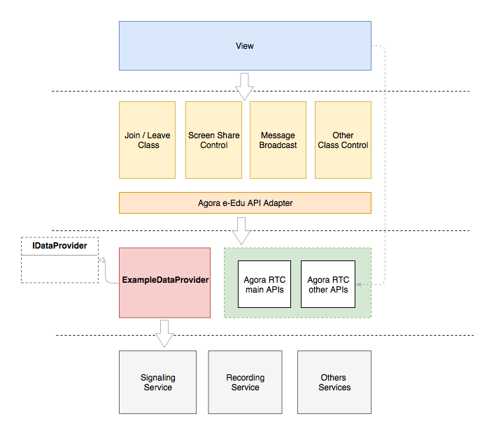

# Introduction

> An open source e-Edu solution based on electron and Agora RTC SDK ( Windows & Mac )

- Encapsulation original APIs as `Adapter` to simpify development for e-Edu app.
- Make the project more scalable. You can extend or modify this application easily based on your situation by implementing your own `Data Provider`.

